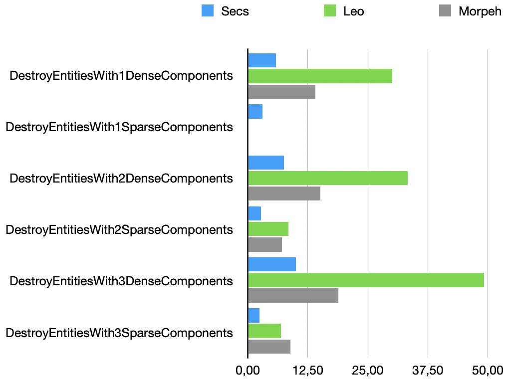

# Secs
Ecs Library for CSharp - Fast, Fluent, Minimalistic 

> [!WARNING]
> This repository just a showcase that sparse-set ecs could be just as fast as archetype ones.
> Its not thread safe, its not covered with tests, the only tested cases is only benchmark cases.

## Benchmarks
> [!NOTE]
> Arch excluded from benchmark because its crashing on high amount
> of entities

### Iteration speed - lower is better

---

### Create entity and add components - lower is better

---

### Add component when iterating - lower is better

---

### Destroy when iterating - lower is better

---

