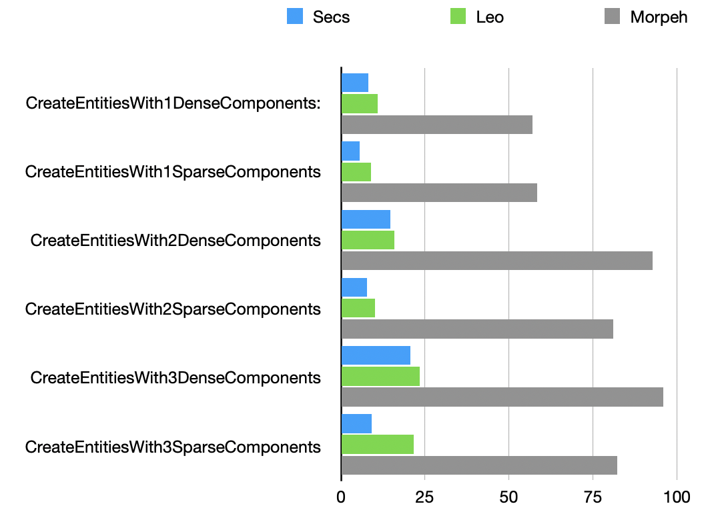

# Secs
Ecs Library for CSharp - Fast, Fluent, Minimalistic 

> [!WARNING]
> This repository just a showcase that sparse-set ecs could be just as fast as archetype ones.
> Its not thread safe, its not covered with tests, the only tested cases is only benchmark cases.

## Benchmarks
> [!NOTE]
> Arch excluded from benchmark because its crashing on high amount
> of entities

> [!NOTE]
> Secs create and add component performance could be improved with same 
> strategy that Leo and Morpeh use - pools of components. Current bottleneck is hashmap that map component type to its id
---
Iteration speed:

 
---
Create entity and add components:

 
---
Add component when iterating:

 
---
Destroy when iterating:

